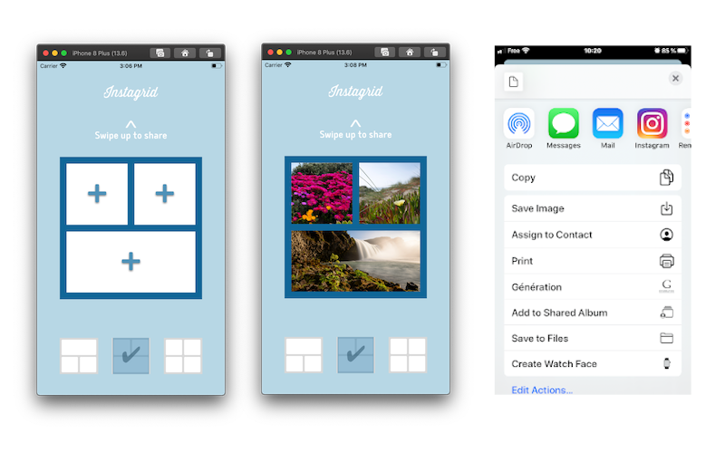

# Projet 5 - Instagrid

Une application de partage de photos

Les fonctionnalités sont :

- Choix du type de grille
- Sélection de photos dans la librairie ou avec l'appareil photo
- Possibilité de changer la couleur de la grille avec un double clic
- Effacer la grille
- Envoyer la grille sur un média au choix
